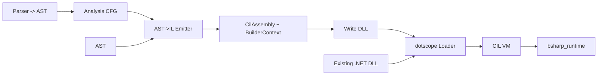

# Architecture

This document describes the architecture for CIL-based code execution using dotscope.

## Crates and modules
- **bsharp_il/**: AST→IL emitter using dotscope builders.
- **bsharp_vm/**: CIL interpreter (eval stack, frames, loader, binder).
- **bsharp_runtime/**: Host intrinsics and minimal library.
- **bsharp_cli/**: Commands to run/inspect assemblies.

## Data flow

## Integration points
- `bsharp_analysis/src/artifacts/control_flow_graph/`: provide structured blocks and edges to guide IL labels/branches.
- dotscope: `MethodBodyBuilder`, metadata table builders, `CilAssembly` write.
- VM loader: `CilAssemblyView` to parse and resolve tokens.

## Error handling
- Deterministic interpreter errors with rich diagnostics (opcode, offset, stack types).
- Validation gates in emitter (e.g., unsupported constructs) produce actionable errors.
